# Protótipo - Flutter

Protótipo de app feito em Flutter, resultado do instruction sobre desenvolvimento mobile

---

## Instalação e configuração do Flutter sem a necessidade de Android Studio (no Windows)

[Vídeo auxiliar](https://www.youtube.com/watch?v=MruPYtw9Lk0&ab_channel=0xPanda) - veja acompanhando as instruções aqui para ter certeza

```
Obs.:
- Caso ao executar algum comando seja necessário uma confirmação, sempre digite "y" para confirmar
- Não é necessário usar os mesmos nomes de pastas que esse tutorial, só tenha certeza de que estamos falando dos mesmos endereços
- Sempre que um comando tiver uma versão, procure na documentação oficial quais as últimas lançadas
- Evite instalar programas que estão em beta ou que foram recém-lançados, visto que as demais ferramentas podem ainda não ter compatibilidade
- Esse tutorial é para o Windows, mas para outros sistemas operacionais não deve distanciar muito. Verifique, entretanto, as documentações oficiais para ter certeza
```

1. Instalar o Flutter
	<ol type="a">
		<li>
			Acesse o <a href="https://docs.flutter.dev/get-started/install" target="_blank">site oficial do Flutter</a> e baixe a versão correspondente ao seu sistema operacional (nessas instruções trataremos do Windows especificamente)
		</li>
		<li>
			Descompacte o arquivo .zip em algum lugar, acesse a pasta <b>D:\flutter\bin</b> e copie o endereço
			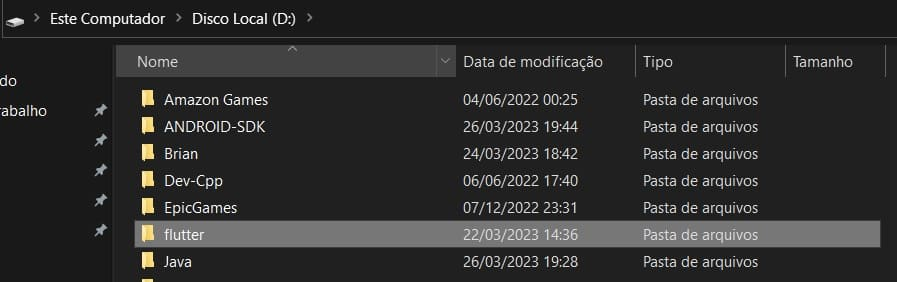
			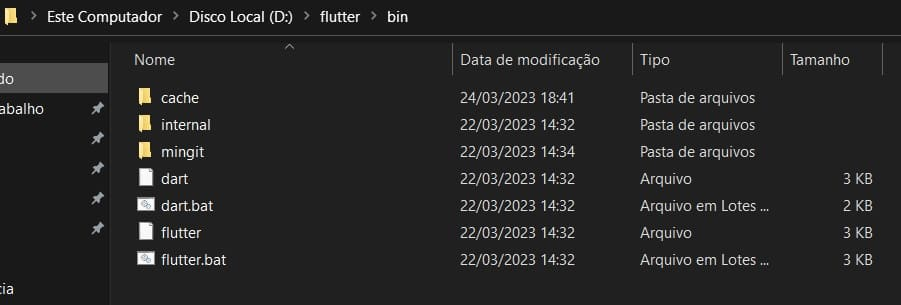
		</li>
		<li>
			Abra as variáveis de ambiente e adicione o caminho copiado anteriormente à variável Path
			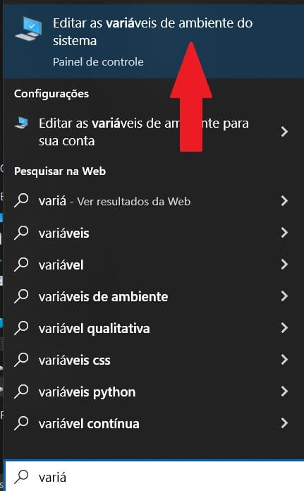
			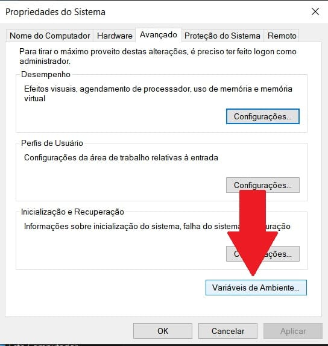
			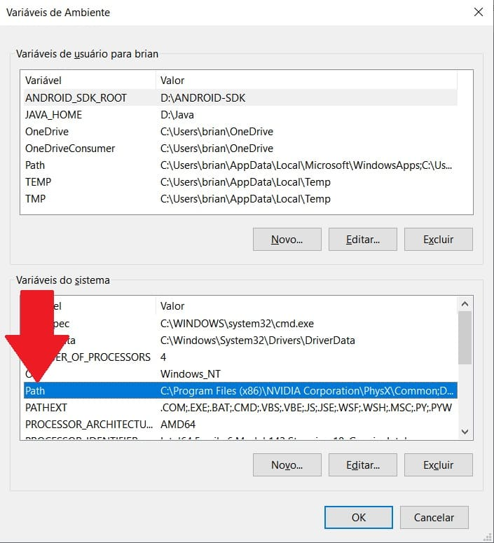
			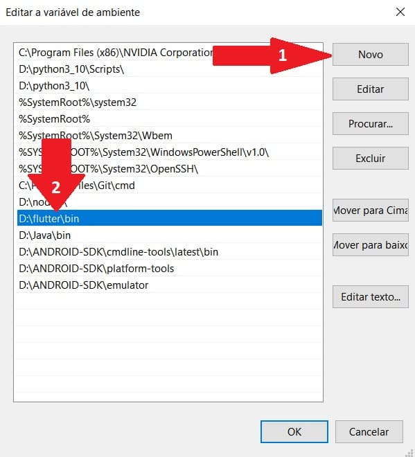	
		</li>
	</ol>

2. Instalar o Java
	<ol type="a">
		<li>
			Diferente do vídeo, recomendamos baixar o <a href="https://learn.microsoft.com/pt-br/java/openjdk/download" target="_blank">Microsoft Build do OpenJDK</a>, pois é mais certo de que a versão baixada já está compatível com as outras ferramentas. Baixe a versão correspondente ao seu sistema operacional e arquitetura do processador. Se você não sabe o que é isso, muito provavelmente sua versão é
			a x64
			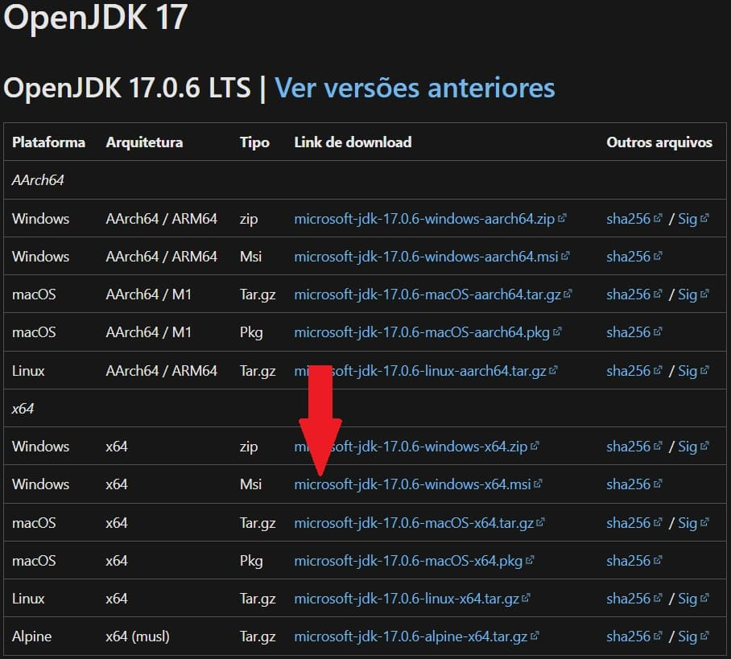
		</li>
		<li>
			Descompacte o arquivo .zip em algum lugar, acesse a pasta <b>D:\Java\bin</b> e copie o endereço
			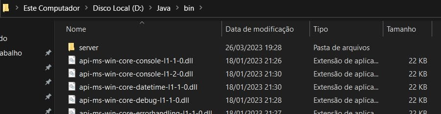
		</li>
		<li>
			Abra as variáveis de ambiente e, assim como no passo <b>1c</b>, adicione o caminho copiado à variável Path
			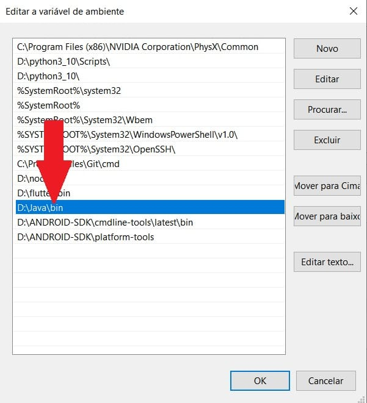
		</li>
		<li>
			Além disso, volte à página anterior e, seguindo a ordem das setas, adicione uma variável de usuário chamada <b>JAVA_HOME</b> com o caminho copiado, mas antes do bin, isto é, <b>D:\Java</b>
			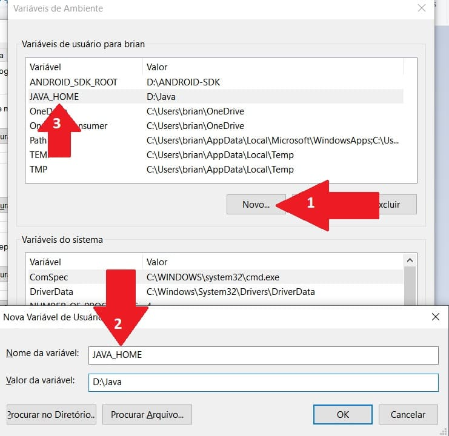
		</li>
		<li>
			Para verificar se ocorreu bem, abra o terminal e digite <pre>javac --version</pre> para ver a versão instalada<br>
			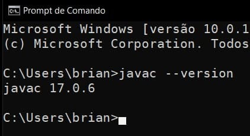
		</li>
	</ol>

3. Instalar o Android SDK
	<ol type="a">
		<li>
			Acesse o <a href="https://developer.android.com/studio#:~:text=Command%20line%20tools%20only" target="_blank">site oficial do Android Developers</a> e baixe a versão correspondente ao seu sistema operacional (nessas instruções trataremos do Windows especificamente). É o que está na seção de <b>Command line tools only</b>
			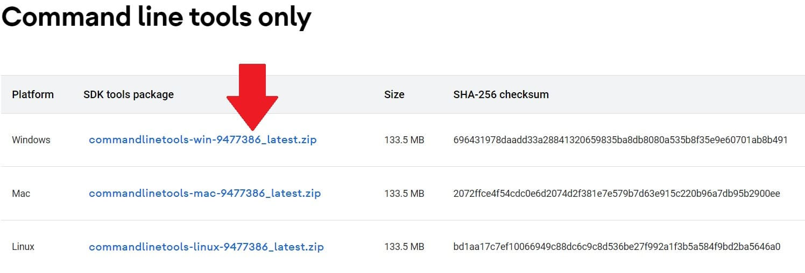
		</li>
		<li>
			Descompacte o arquivo .zip em algum lugar, acesse a pasta <b>D:\ANDROID-SDK\cmdline-tools\bin</b> e abra o terminal nesse endereço
			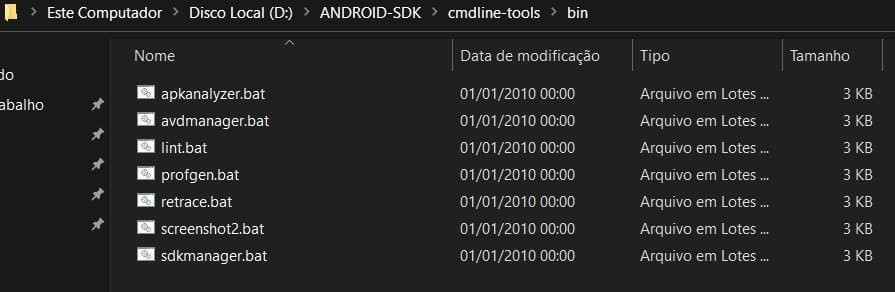
			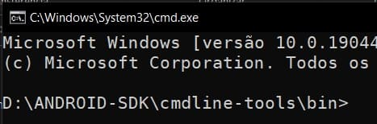
		</li>
		<li>
			No terminal aberto digite o comando (uma única linha) <pre>sdkmanager.bat --install "cmdline-tools;latest" --sdk_root=../../</pre> e pressione "y" caso apareça alguma pergunta
			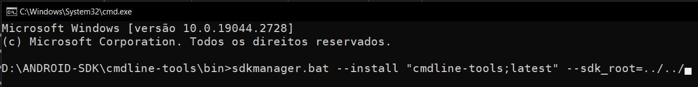
		</li>
		<li>
			Assim como no passo <b>2d</b>, abra as variáveis de ambiente e adicione uma variável de usuário chamada <b>ANDROID_SDK_ROOT</b> com o caminho <b>D:\ANDROID-SDK</b><br>
			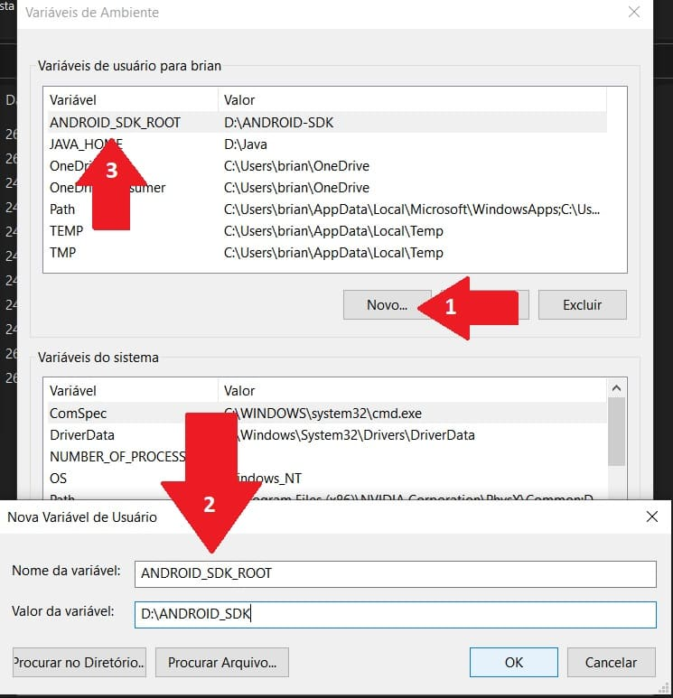
		</li>
		<li>
			Abra as variáveis de ambiente e, assim como no passo <b>2c</b>, adicione o caminho <b>D:\ANDROID-SDK\cmdline-tools\latest\bin</b> à variável Path
			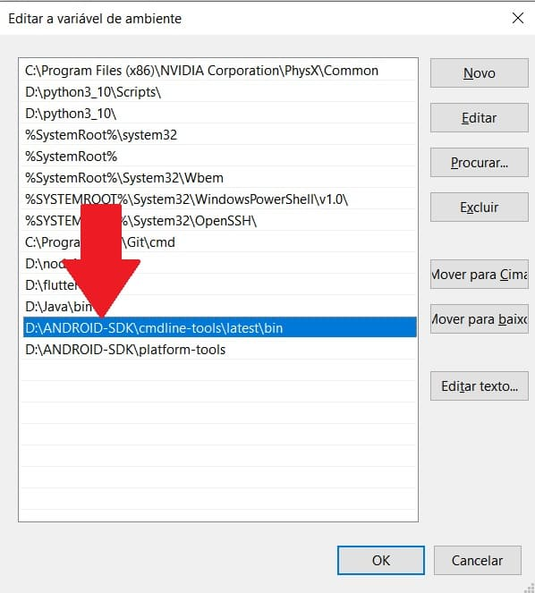
		</li>
		<li>
			Antes de prosseguir, abra a <a href="https://developer.android.com/studio/releases/build-tools?hl=pt-br">documentação do Android SDK</a> para verificar as últimas versões. No momento desse tutorial o Android 14 está em beta, portanto, use a versão anterior, a não ser que ele já tenha sido lançado quando você for fazer. Anote o número da versão.
			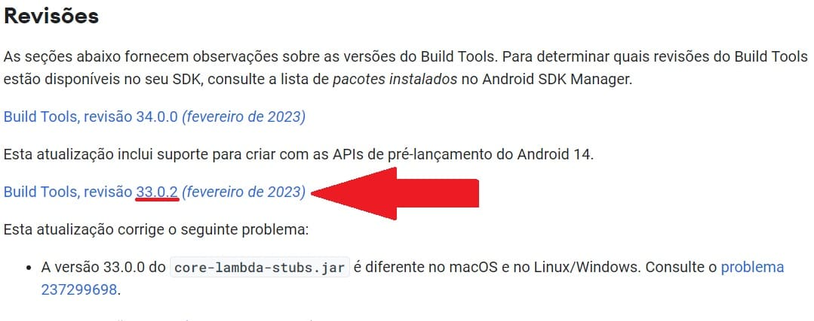
			Em seguida, abra o terminal e digite, usando o número da versão que você anotou, o comando <pre>sdkmanager.bat "build-tools;33.0.2"</pre>
		</li>
		<li>
			De maneira análoga ao passo anterior, <a href="https://developer.android.com/studio/releases/platforms?hl=pt-br">acesse a documentação</a> e verifique as últimas versões, considerando o mesmo aviso sobre o Android 14 (ou versões posteriores). Anote o número do nível.
			
			Em seguida, abra o terminal e digite, usando o número do nível que você anotou, o comando <pre>sdkmanager.bat  "platforms;android-33"</pre>
		</li>
		<li>
			Abra as variáveis de ambiente e, assim como no passo <b>3e</b>, adicione o caminho <b>D:\ANDROID-SDK\platform-tools</b> à variável Path
			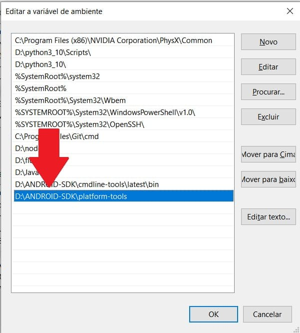
		</li>
	</ol>

4. Configurar o Flutter
	<ol type="a">
		<li>
			Abra o terminal e digite o comando <pre>flutter config --android-sdk %ANDROID_SDK_ROOT%</pre>
		</li>
		<li>
			Ao concluir digite o comando <pre>flutter doctor --android-licenses</pre> e confirme com "y" para aceitar as licenças
		</li>
		<li>
			Por fim, digite <pre>flutter doctor</pre> para verificar se tudo funcionou. Se houver um visto ✅ ao lado de <b>Android toolchain</b>, parabéns, você fez tudo direitinho! 
			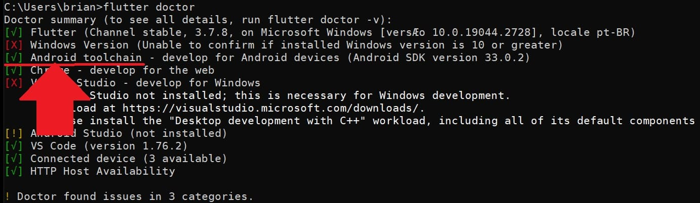
		</li>
	</ol>
